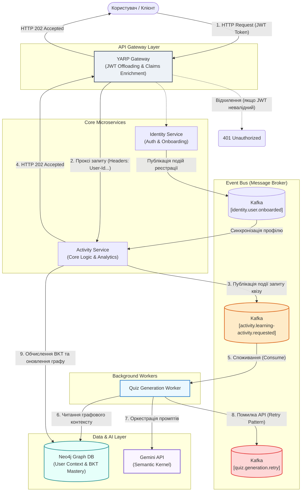
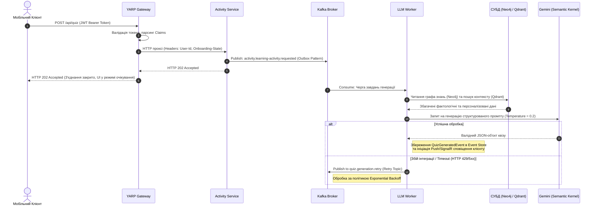

# 📘 Quizzer: Платформа для персоналізованого аналізу ігрової активності

> Серверна частина дипломного проєкту **Quizzer**: мікросервісна система для реєстрації користувачів, онбордингу та адаптивної генерації квізів на основі графа знань і моделі засвоєння.

---

## 👤 Автор

- **ПІБ**: Малий Ренат Миколайович
- **Група**: ФЕІ-43
- **Керівник**: доц. Франів В. А.

---

## 📌 Загальна інформація

- **Тип проєкту**: серверна частина веб/мобільної навчальної системи
- **Мова програмування**: C# (.NET 10)
- **Архітектура**: мікросервіси + API Gateway + event-driven обмін через Kafka
- **Основні технології**:
  - ASP.NET Core Minimal API
  - YARP Reverse Proxy
  - Marten (Event Sourcing + Projections) + PostgreSQL
  - Apache Kafka (інтеграційні події)
  - Neo4j (граф знань)
  - Qdrant (векторний пошук)
  - Google Gemini через Semantic Kernel (генерація контенту)
  - Serilog (структуроване логування)
  - Kubernetes (K3s, Helm, Bitnami Sealed Secrets)

---
## 🔬 Науково-методологічна база

Персоналізація навчальної траєкторії базується на синергії трьох математичних моделей:

### 1. Bayesian Knowledge Tracing (BKT)
Розрахунок апостеріорної ймовірності володіння навичкою $P(L_t)$ після отримання відповіді користувача (правильної чи помилкової) здійснюється на основі теореми Баєса:
$$P(L_t) = P(L_{t-1}|obs) + (1 - P(L_{t-1}|obs)) \cdot P(T)$$
*Де $P(T)$ — ймовірність переходу концепту в стан «знає» під час поточного кроку навчання.*

### 2. Пріоритезація інтервальних повторень (Spaced Repetition)
Дискретна модифікація кривої забування Еббінгауза для ранжування тем у графовій базі Neo4j:
$$Priority = (1.0 - P_{learned}) + (d_{since} \cdot W_f)$$
*Де $P_{learned}$ — поточний рівень майстерності за BKT, $d_{since}$ — кількість діб з останнього контакту, а $W_f = 0.015$ — емпіричний коефіцієнт інтенсивності забування.*

### 3. Семантичний векторний пошук (RAG)
Оцінка релевантності текстових фрагментів онтології Computer Science Ontology (CSO) у сховищі Qdrant за допомогою косинусної подібності векторів:
$$\text{similarity} = \cos(\theta) = \frac{A \cdot B}{\|A\| \|B\|}$$

---
## 🏗 Розподілена архітектура системи

Проєкт спроєктовано із суворим дотриманням принципів предметно-орієнтованого проєктування (**DDD**), шаблонів **CQRS** та ізоляції даних (**Database-per-Service**).

### ⚙️ Серверна інфраструктура (Backend)
* **`YARP API Gateway`**: Єдина точка входу системи. Виконує маршрутизацію трафіку, Rate Limiting, балансування навантаження та **JWT Offloading** (децентралізована валідація токенів за допомогою алгоритму RS256 та збагачення внутрішніх HTTP-заголовків claims: `User-Id`, `Session-Id`, `Onboarding-State`).
* **`Identity Service`**: Побудований на базі OpenIddict (OAuth 2.0 / OpenID Connect). Керує обліковими записами, життєвим циклом токенів та процесом первинного онбордингу.
* **`Activity Service`**: Ядро бізнес-логіки. Фіксує доменні події через Marten у PostgreSQL (Write Model) та асинхронно оновлює денормалізовані представлення для швидкого читання (Read Model).
* **`LLM Worker Service`**: Фоновий сервіс-консьюмер. Оркеструє запити до Neo4j, Qdrant та Gemini API за допомогою інструментарію **Microsoft Semantic Kernel**.

### 📱 Мобільний клієнт (Unity 2022 LTS)
* **UI Toolkit (Retained Mode):** Побудова інтерфейсу за допомогою декларативних мов розмітки UXML та USS із Flexbox-лейаутом (рушій Yoga).
* **State Machine & UI Stack:** Навігація на основі детермінованих станів екранів (`BootstrapState` $\rightarrow$ `AuthenticationState` $\rightarrow$ `HomeState` $\rightarrow$ `ActiveQuizState`).
* **Reactive Binding:** Кастомна реактивна підсистема (`IReadOnlyReactiveProperty<T>`) для синхронізації доменного стану з UI.
* **Result Pattern:** Функціональна обробка помилок (монада `Result<T>`), що виключає деградацію продуктивності та навантаження на Garbage Collector блоками `try-catch`.

---

## 🧭 Конвеєр асинхронної генерації контенту


Обробка тривалих запитів до LLM ізольована від основного клієнтського потоку за допомогою патерну **Asynchronous Request-Reply** через брокер повідомлень Apache Kafka.


## ☁️ Інфраструктура та розгортання (Kubernetes / Helm)

Хмарна інфраструктура проєкту розгорнута на базі серверів провайдера **Hetzner** та керується пакетним менеджером Helm. Архітектура репозиторію побудована за суворим принципом: **"одна зона = одна відповідальність"**[cite: 3]. Це гарантує ізоляцію інфраструктури від бізнес-логіки та безпеку секретних даних.

### 1) Структура директорій (Umbrella Chart Pattern)
* **`bootstrap/`**: Підготовка середовища. Містить створення просторів імен та зашифровані конфігурації секретів (доступи до БД, реєстрів, JWT ключі). Ці маніфести застосовуються до розгортання Helm-чартів[cite: 3].
* **`charts/platform/`**: Спільні інфраструктурні залежності. Відповідає за розгортання баз даних та брокерів повідомлень (PostgreSQL, Kafka, MongoDB)[cite: 3]. Додатки лише споживають ці сервіси, але не створюють їх.
* **`charts/applications/`**: Прикладний чарт. Об'єднує всі бізнес-мікросервіси системи (`api-gateway`, `identity-service`, `activity-service` тощо)[cite: 3].
* **`environments/`**: Специфічні змінні (`values.yaml`) для різних контурів (`dev`, `prod`). Вони містять лише посилання на імена секретів і **ніколи** не містять їхніх відкритих значень[cite: 3].

### 2) Управління секретами (Bitnami Sealed Secrets)
Проєкт використовує GitOps-безпечний підхід до роботи з конфіденційними даними. Сирі секрети (plaintext) зберігаються у локальній директорії `bootstrap/<env>/plain-secrets/` та ігноруються системою контролю версій (Git)[cite: 5]. За допомогою PowerShell-скрипта `seal-secrets.ps1` вони локально шифруються у маніфести `SealedSecret` та поміщаються у теку `sealed-secrets/`, яка вже безпечно комітиться в репозиторій[cite: 5]. Їх дешифрування відбувається автоматично всередині кластера контролером Sealed Secrets[cite: 4, 5].

### 3) Порядок розгортання (Runbook)
**Передумови:** У кластері вже мають бути встановлені Kubernetes Operators для баз даних (**CloudNativePG**, **Strimzi Kafka Operator**, **Percona Server for MongoDB Operator**) та Ingress Controller (наприклад, Traefik)[cite: 4].

Розгортання системи відбувається у жорсткій послідовності (на прикладі середовища `dev`):

```bash
# 1. Створення простору імен та застосування зашифрованих секретів
kubectl apply -f bootstrap/dev/namespace.yaml
kubectl apply -f bootstrap/dev/sealed-secrets/

# 2. Встановлення базових залежностей та інфраструктури платформи
helm dependency build charts/platform
helm upgrade --install platform charts/platform \
  -n quizzer-dev \
  -f environments/dev/platform.yaml

# 3. Встановлення бізнес-мікросервісів
helm dependency build charts/applications
helm upgrade --install applications charts/applications \
  -n quizzer-dev \
  -f environments/dev/applications.yaml
```

*Для повного видалення системи з кластера достатньо видалити Helm-релізи (`helm uninstall applications`, `helm uninstall platform`) та очистити простір імен (`kubectl delete namespace quizzer-dev`)[cite: 4].*

---

## 🖱️ Коротка інструкція для користувача системи

1. Створити або авторизувати гостьовий акаунт.
2. Заповнити онбординг (цілі, інтереси, рівень).
3. Створити квіз у manual або smart режимі.
4. Дочекатися завершення генерації питань (статус із `pending` переходить у `ready`).
5. Пройти квіз, відповідаючи по одному питанню.
6. Переглянути аналітику квізу та персональний дашборд.

---

## 📷 Приклади / скриншоти

<table>
  <tr>
    <td align="center"><b>Авторизація</b></td>
    <td align="center"><b>Онбординг</b></td>
    <td align="center"><b>Список квізів</b></td>
  </tr>
  <tr>
    <td></td>
    <td></td>
    <td></td>
  </tr>
  <tr>
    <td align="center"><b>Проходження квізу</b></td>
    <td align="center"><b>Дашборд аналітики</b></td>
    <td></td>
  </tr>
  <tr>
    <td></td>
    <td></td>
    <td></td>
  </tr>
</table>

---

## 🔗 Посилання на репозиторій

- **GitHub**: [https://github.com/MMikilanjelo/Quizzer/tree/develop](https://github.com/MMikilanjelo/Quizzer/tree/develop)

---

## 🧾 Використані джерела / література

- Microsoft Docs: ASP.NET Core Minimal APIs
- YARP Reverse Proxy Documentation
- Marten Documentation (Event Sourcing / Projections)
- Apache Kafka + Confluent.Kafka .NET
- Neo4j Documentation
- Qdrant Documentation
- Microsoft Semantic Kernel Documentation
- Google Gemini API Documentation
- Kubernetes & Helm Documentation