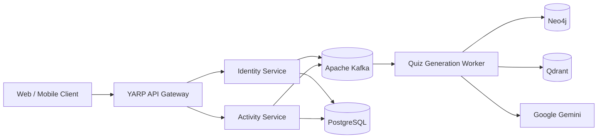
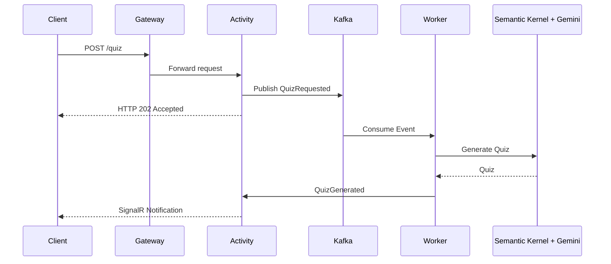
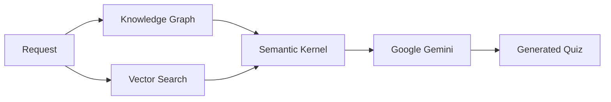

# Quizzer

> **AI-powered distributed learning platform** built with **ASP.NET Core**, **Kafka**, **CQRS/Event Sourcing**, **Neo4j**, **Qdrant**, and **Semantic Kernel**.

Quizzer is a production-style backend project demonstrating modern distributed system design, event-driven communication, and AI orchestration. The platform generates personalized quizzes using a knowledge graph, vector search, Bayesian Knowledge Tracing, and large language models.

---

# Features

- Distributed microservice architecture
- Event-driven communication with Apache Kafka
- CQRS + Event Sourcing (Marten)
- ASP.NET Core Minimal APIs
- YARP API Gateway
- OAuth2 / OpenID Connect (OpenIddict)
- Neo4j Knowledge Graph
- Qdrant Vector Search
- Semantic Kernel + Google Gemini
- Docker & Kubernetes deployment

---

# System Architecture



---

# Asynchronous Quiz Generation



---

# AI Pipeline



---

# Architecture Highlights

## Authentication

- OAuth2 / OpenID Connect
- JWT Authentication
- Refresh Token lifecycle
- API Gateway token validation

## Distributed Systems

- Database-per-Service
- Event-driven messaging with Kafka
- CQRS + Event Sourcing
- Background workers
- Asynchronous Request-Reply

## AI & Personalization

- Bayesian Knowledge Tracing
- Knowledge Graph navigation
- Retrieval-Augmented Generation (RAG)
- Personalized quiz generation

---

# Technology Stack

| Area | Technologies |
|------|--------------|
| Backend | ASP.NET Core, Minimal APIs |
| Architecture | Microservices, CQRS, Event Sourcing |
| Messaging | Apache Kafka |
| Databases | PostgreSQL, Neo4j, Qdrant |
| AI | Semantic Kernel, Google Gemini |
| Gateway | YARP Reverse Proxy |
| Authentication | OpenIddict, OAuth2, OpenID Connect |
| Deployment | Docker, Kubernetes |

---

# Why this architecture?

Quizzer explores production-grade backend engineering patterns instead of a traditional CRUD application.

Key architectural decisions include:

- Event-driven communication instead of synchronous service calls.
- CQRS and Event Sourcing to separate write and read models.
- Neo4j for representing relationships between learning concepts.
- Qdrant for semantic retrieval and contextual search.
- Semantic Kernel for orchestrating LLM interactions.
- YARP API Gateway as the single entry point for authentication and routing.

---

# Repository Structure

```text
gateway/
identity-service/
activity-service/
quiz-worker/
shared/
infrastructure/
etl/
deploy/
```

---

# Getting Started

```bash
git clone <repository>

dotnet restore

docker compose up -d

dotnet run
```

For infrastructure setup, Kubernetes deployment, secrets, and ETL instructions, see **RUNBOOK.md**.

---

# Screenshots

| Authentication | Onboarding | Dashboard |
|---------------|------------|-----------|
|  |  |  |

