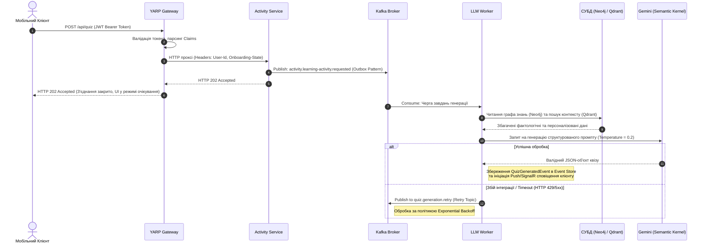
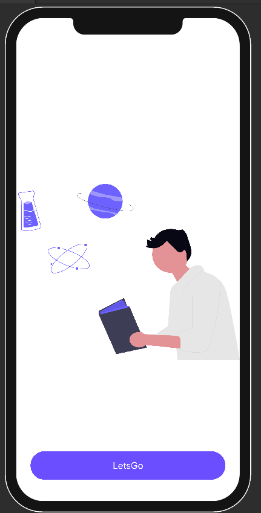
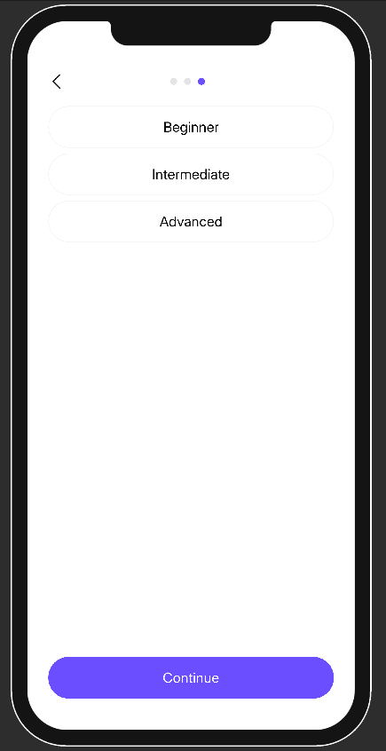
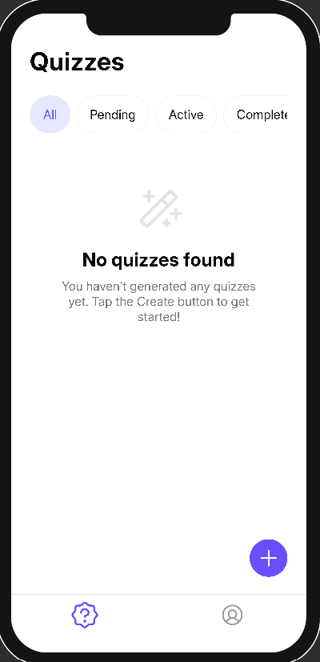
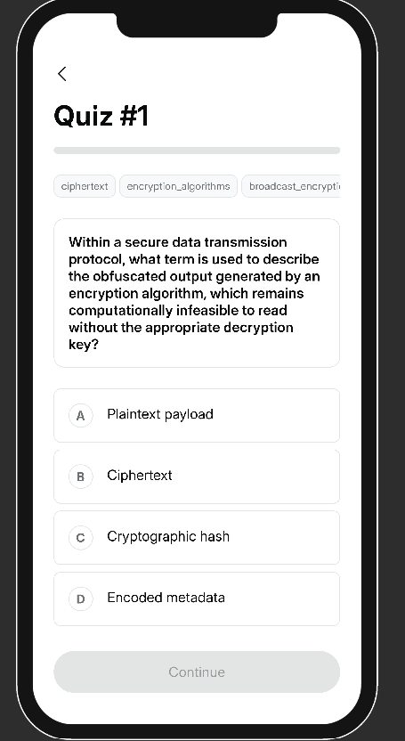
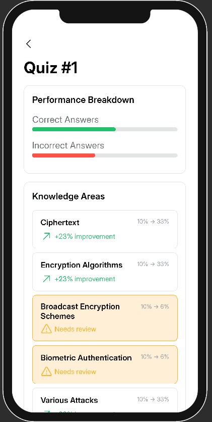

# 📘 Quizzer: Платформа для персоналізованого аналізу ігрової активності

> Серверна частина дипломного проєкту **Quizzer**: мікросервісна система для реєстрації користувачів, онбордингу та адаптивної генерації квізів на основі графа знань і моделі засвоєння.

---

## 👤 Автор

- **ПІБ**: Малий Ренат Миколайович
- **Група**: ФЕІ-43
- **Керівник**: доц. Франів В. А.

---

## 📌 Загальна інформація

- **Тип проєкту**: серверна частина веб/мобільної навчальної системи
- **Мова програмування**: C# (.NET 10)
- **Архітектура**: мікросервіси + API Gateway + event-driven обмін через Kafka
- **Основні технології**:
  - ASP.NET Core Minimal API
  - YARP Reverse Proxy
  - Marten (Event Sourcing + Projections) + PostgreSQL
  - Apache Kafka (інтеграційні події)
  - Neo4j (граф знань)
  - Qdrant (векторний пошук)
  - Google Gemini через Semantic Kernel (генерація контенту)
  - Serilog (структуроване логування)
  - Kubernetes (K3s, Helm, Bitnami Sealed Secrets)

---
## 🔬 Науково-методологічна база

Персоналізація навчальної траєкторії базується на синергії трьох математичних моделей:

### 1. Bayesian Knowledge Tracing (BKT)
Розрахунок апостеріорної ймовірності володіння навичкою $P(L_t)$ після отримання відповіді користувача (правильної чи помилкової) здійснюється на основі теореми Баєса:
$$P(L_t) = P(L_{t-1}|obs) + (1 - P(L_{t-1}|obs)) \cdot P(T)$$
*Де $P(T)$ — ймовірність переходу концепту в стан «знає» під час поточного кроку навчання.*

### 2. Пріоритезація інтервальних повторень (Spaced Repetition)
Дискретна модифікація кривої забування Еббінгауза для ранжування тем у графовій базі Neo4j:
$$Priority = (1.0 - P_{learned}) + (d_{since} \cdot W_f)$$
*Де $P_{learned}$ — поточний рівень майстерності за BKT, $d_{since}$ — кількість діб з останнього контакту, а $W_f = 0.015$ — емпіричний коефіцієнт інтенсивності забування.*

### 3. Семантичний векторний пошук (RAG)
Оцінка релевантності текстових фрагментів онтології Computer Science Ontology (CSO) у сховищі Qdrant за допомогою косинусної подібності векторів:
$$\text{similarity} = \cos(\theta) = \frac{A \cdot B}{\|A\| \|B\|}$$

---
## 🏗 Розподілена архітектура системи

Проєкт спроєктовано із суворим дотриманням принципів предметно-орієнтованого проєктування (**DDD**), шаблонів **CQRS** та ізоляції даних (**Database-per-Service**).

### ⚙️ Серверна інфраструктура (Backend)
* **`YARP API Gateway`**: Єдина точка входу системи. Виконує маршрутизацію трафіку, Rate Limiting, балансування навантаження та **JWT Offloading** (децентралізована валідація токенів за допомогою алгоритму RS256 та збагачення внутрішніх HTTP-заголовків claims: `User-Id`, `Session-Id`, `Onboarding-State`).
* **`Identity Service`**: Побудований на базі OpenIddict (OAuth 2.0 / OpenID Connect). Керує обліковими записами, життєвим циклом токенів та процесом первинного онбордингу.
* **`Activity Service`**: Ядро бізнес-логіки. Фіксує доменні події через Marten у PostgreSQL (Write Model) та асинхронно оновлює денормалізовані представлення для швидкого читання (Read Model).
* **`LLM Worker Service`**: Фоновий сервіс-консьюмер. Оркеструє запити до Neo4j, Qdrant та Gemini API за допомогою інструментарію **Microsoft Semantic Kernel**.

### 📱 Мобільний клієнт (Unity 2022 LTS)
* **UI Toolkit (Retained Mode):** Побудова інтерфейсу за допомогою декларативних мов розмітки UXML та USS із Flexbox-лейаутом (рушій Yoga).
* **State Machine & UI Stack:** Навігація на основі детермінованих станів екранів (`BootstrapState` $\rightarrow$ `AuthenticationState` $\rightarrow$ `HomeState` $\rightarrow$ `ActiveQuizState`).
* **Reactive Binding:** Кастомна реактивна підсистема (`IReadOnlyReactiveProperty<T>`) для синхронізації доменного стану з UI.
* **Result Pattern:** Функціональна обробка помилок (монада `Result<T>`), що виключає деградацію продуктивності та навантаження на Garbage Collector блоками `try-catch`.

---

## 🧭 Конвеєр асинхронної генерації контенту

Обробка тривалих запитів до LLM ізольована від основного клієнтського потоку за допомогою патерну **Asynchronous Request-Reply** через брокер повідомлень Apache Kafka.

## 🚀 Інструкція з запуску та тестування

Для перевірки та локального запуску системи не потрібно завантажувати скомпільовані бібліотеки чи кеші — всі залежності підтягуються автоматично на етапі збірки.

### ⚡ Швидке тестування (Готовий застосунок)
Оскільки серверна частина проєкту вже розгорнута у хмарі та працює 24/7, вам **не обов'язково** розгортати локальну інфраструктуру чи збирати клієнт із вихідного коду для перевірки працездатності.

Ви можете одразу завантажити готову збірку клієнтського застосунку та розпочати тестування:
👉 **[\[Посилання на завантаження готового застосунку\]](https://drive.google.com/file/d/1noDsUyckIvBKlu6YoLHdWROh_REEgN9r/view?usp=sharing)**

Після завантаження просто відкрийте програму — вона автоматично підключена до хмарного API Gateway.

---

### ⚠️ Локальне розгортання Інфраструктури та Backend
Якщо ви бажаєте перевірити серверну частину або розгорнути мікросервіси та бази даних (PostgreSQL, Kafka, MongoDB, Neo4j, Qdrant) локально, повний процес описано в окремому документі. 
👉 **Обов'язково ознайомтеся з [RUNBOOK.md](RUNBOOK.md).**

**Встановлення залежностей для .NET:**
Щоб відновити всі NuGet-пакети для мікросервісів, перейдіть у кореневу папку серверної частини та виконайте:
\`\`\`bash
dotnet restore
\`\`\`
*Примітка: Взаємодія з LLM відбувається через хмарний API Google Gemini, тому локальне завантаження важких ML-моделей не вимагається. Переконайтеся, що ви додали свій API-ключ у відповідний секрет згідно з Runbook.*

**Сидування графа знань (Neo4j ETL):**
Після успішного підняття та запуску локальної інфраструктури обов'язково потрібно ініціалізувати онтологію системи. Для цього необхідно запустити ETL-процес, який заповнить базу даних Neo4j:

Відповідний Jupyter-ноутбук (скрипт) для міграції та сидування початкового графа знань лежить у папці etl/.

Переконайтеся, що контейнер / сервіс Neo4j уже запущений та доступний, перед тим як виконувати цей скрипт.

### 🎮 Локальний запуск мобільного клієнта (Unity)
Клієнтський застосунок створено на базі **Unity 2022 LTS**. В архіві відсутній каталог `Library`, щоб зекономити місце, тому перший запуск займе трохи більше часу на імпорт асетів.

**Кроки для запуску в редакторі:**
1. Відкрийте **Unity Hub**.
2. Натисніть **Add** (або Open) і виберіть папку клієнтського проєкту (де знаходиться папка `Assets`).
3. Виберіть версію редактора **Unity 2022.3.x LTS** (якщо вона не встановлена, Unity Hub запропонує її завантажити).
4. Дочекайтеся завершення процесу імпорту. Unity автоматично завантажить усі необхідні пакети (з Unity Registry) відповідно до файлу `Packages/manifest.json`.
5. Після відкриття редактора перейдіть до папки `Assets/Scenes` (або відповідної папки з вашими сценами) і відкрийте стартову сцену (наприклад, `BootstrapScene`).
6. Натисніть кнопку **Play** (▶️) у верхній частині редактора для запуску клієнта.

---

## 🖱️ Коротка інструкція для користувача системи

1. Створити або авторизувати гостьовий акаунт.
2. Заповнити онбординг (цілі, інтереси, рівень).
3. Створити квіз у manual або smart режимі.
4. Дочекатися завершення генерації питань (статус із `pending` переходить у `ready`).
5. Пройти квіз, відповідаючи по одному питанню.
6. Переглянути аналітику квізу та персональний дашборд.

---

## 📷 Приклади / скриншоти

<table>
  <tr>
    <td align="center"><b>Авторизація</b></td>
    <td align="center"><b>Онбординг</b></td>
    <td align="center"><b>Список квізів</b></td>
  </tr>
  <tr>
    <td></td>
    <td></td>
    <td></td>
  </tr>
  <tr>
    <td align="center"><b>Проходження квізу</b></td>
    <td align="center"><b>Дашборд аналітики</b></td>
    <td></td>
  </tr>
  <tr>
    <td></td>
    <td></td>
    <td></td>
  </tr>
</table>

---

## 🔗 Посилання на репозиторій

- **GitHub**: [https://github.com/MMikilanjelo/Quizzer/tree/develop](https://github.com/MMikilanjelo/Quizzer/tree/develop)

---

## 🧾 Використані джерела / література

- Microsoft Docs: ASP.NET Core Minimal APIs
- YARP Reverse Proxy Documentation
- Marten Documentation (Event Sourcing / Projections)
- Apache Kafka + Confluent.Kafka .NET
- Neo4j Documentation
- Qdrant Documentation
- Microsoft Semantic Kernel Documentation
- Google Gemini API Documentation
- Kubernetes & Helm Documentation